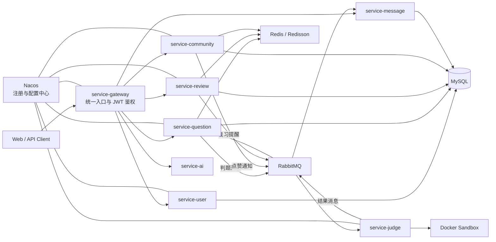

# CodeWise

面向编程学习、在线判题与错题复习场景的 Spring Cloud 微服务系统。

CodeWise 将题库、代码判题、提交记录、复习计划、社区题解、消息通知和 AI 辅助能力拆分为独立服务，重点实践异步判题、服务间通信、缓存一致性、游标分页、WebSocket 推送以及容器化代码执行等后端工程问题。


## 项目能力

- 在线判题：代码提交、调试运行、测试点执行、结果回写和状态推送。
- 题库管理：题目、标签、难度、测试用例、提交记录及题目详情。
- 复习系统：根据提交结果生成复习记录，维护每日复习与收藏夹。
- 学习社区：帖子、题解、评论、回复、点赞、标签搜索和热点排行。
- 用户中心：注册登录、JWT 鉴权、资料维护、头像上传和用户统计。
- 消息通知：统一承载邮件、站内通知、RabbitMQ 消费和 WebSocket 实时推送。
- AI 辅助：题目解析与测试用例生成，支持不同模型处理器扩展。

## 系统架构



## 技术栈

| 分类 | 技术 |
| --- | --- |
| 基础框架 | Java 21、Spring Boot 3.2.4、Maven |
| 微服务 | Spring Cloud、Spring Cloud Alibaba、Nacos、OpenFeign、Gateway |
| 数据访问 | MySQL、MyBatis-Plus、MyBatis XML |
| 缓存与并发 | Redis、Redisson、Lua Script、分布式锁 |
| 异步通信 | RabbitMQ、定时任务、异步任务 |
| 实时通信 | WebSocket |
| 判题隔离 | Docker Java API、容器资源限制 |
| 安全 | JWT、Spring Security、网关全局过滤器 |
| AI 接入 | WebFlux、Reactor Netty、可替换模型处理器 |

## 服务模块

| 模块 | 默认端口 | 职责 |
| --- | ---: | --- |
| `service-gateway` | 8082 | 统一路由、JWT 校验、用户上下文透传 |
| `service-user` | 8081 | 注册登录、用户资料、头像、用户统计 |
| `service-question` | 8084 | 题目、测试点、提交记录、判题入口 |
| `service-judge` | 8086 | Docker 沙箱执行、编译运行、结果判定 |
| `service-review` | 8097 | 复习计划、每日复习、收藏夹 |
| `service-community` | 8087 | 帖子、题解、评论、点赞、标签与热点榜 |
| `service-message` | 8083 | 邮件、站内通知、消息消费、WebSocket 推送 |
| `service-ai` | 8085 | AI 解析和测试用例生成 |
| `service-api` | - | Feign 接口及跨服务 DTO 契约 |
| `service-common` | - | JWT、Redis、RabbitMQ、上下文等公共能力 |

## 工程亮点

### 异步判题链路

题目服务接收提交后通过 RabbitMQ 投递判题任务，判题服务在 Docker 容器中完成编译和运行，再通过消息回写提交状态。请求线程无需等待完整判题过程，最终结果可通过 WebSocket 推送给用户。

### Docker 判题隔离

判题模块通过 Docker Java API 创建运行环境，对不可信代码进行容器级隔离，并围绕编译错误、运行错误、超时、内存限制和测试点结果组织判题流程。

### Redis 双桶与 Lua 原子切换

帖子点赞、评论点赞和题解浏览量先写入 Redis 增量桶，定时任务通过 Lua 原子切换读写桶，再批量回写 MySQL。Redisson 任务锁用于避免定时任务重叠消费同一个桶。

### 社区热点排行

使用 Redis ZSet 保存帖子热度，综合点赞数、评论数和发布时间衰减计算分数。定时任务周期性从数据库重建排行，互动行为在重建间隔内实时调整分数。

### 游标分页与批量聚合

题目、帖子、评论和题解列表采用游标分页，避免深分页的扫描成本。用户、标签和点赞状态通过批量查询聚合，减少逐条查询造成的 N+1 问题。

### JavaScript Long 精度处理

后端主键使用 `BIGINT/Long`，对需要直接返回前端的用户 ID 等字段按字符串输出，避免超过 JavaScript 安全整数范围后出现精度丢失。

### 统一通知中心

点赞与每日复习提醒通过 RabbitMQ 进入 `service-message`，先以 `message_id` 唯一索引完成数据库幂等入库，再尝试 WebSocket 实时推送。通知列表使用倒序游标分页，摘要与详情分离；查看详情时自动标记已读，扩展数据仅在详情响应中解析为 JSON 对象。

## 核心业务流程

```text
提交代码
  -> service-question 创建提交记录
  -> RabbitMQ 投递判题任务
  -> service-judge 拉取题目与测试数据
  -> Docker 容器编译、运行并比对输出
  -> RabbitMQ 回传判题结果
  -> 更新提交记录与用户统计
  -> service-message / WebSocket 推送结果
  -> 错题进入 service-review 复习链路
```

更完整的流程说明见 [技术设计文档](docs/technical-design.md)。

## 项目结构

```text
CodeWise/
|-- service-gateway/      # 网关与鉴权
|-- service-user/         # 用户服务
|-- service-question/     # 题库与提交服务
|-- service-judge/        # Docker 判题服务
|-- service-review/       # 复习与收藏服务
|-- service-community/    # 社区与题解服务
|-- service-message/      # 消息、邮件与 WebSocket
|-- service-ai/           # AI 能力
|-- service-api/          # Feign 契约与共享 DTO
|-- service-common/       # 公共基础设施
|-- docs/                 # 接口与技术文档
|-- pom.xml               # Maven 父工程
`-- mvnw / mvnw.cmd       # Maven Wrapper
```

详细目录及各包职责见 [项目目录说明](docs/project-structure.md)。

## 本地运行

### 环境要求

- JDK 21
- MySQL 8.x
- Redis
- RabbitMQ
- Nacos
- Docker，运行判题服务时需要

### 数据库约定

各业务服务使用独立数据库，命名规则为：

```text
codewise_<去掉 service- 后的模块名>
```

例如：`codewise_user`、`codewise_question`、`codewise_review`、`codewise_community`、`codewise_message`。

建表脚本位于各模块的 `src/main/resources`，服务连接信息主要通过 Nacos 配置管理。

### 编译

Windows：

```powershell
.\mvnw.cmd -DskipTests compile
```

Linux / macOS：

```bash
./mvnw -DskipTests compile
```

公共模块发生变更时，先安装到本地 Maven 仓库：

```powershell
cd service-common
..\mvnw.cmd -DskipTests install

cd ..\service-api
..\mvnw.cmd -DskipTests install
```

### 推荐启动顺序

```text
MySQL / Redis / RabbitMQ / Nacos / Docker
  -> service-common、service-api 安装
  -> service-user
  -> service-question
  -> service-judge
  -> service-review
  -> service-community
  -> service-message
  -> service-ai
  -> service-gateway
```

## 文档导航

- [技术设计与核心链路](docs/technical-design.md)
- [项目目录说明](docs/project-structure.md)
- [后端 Controller 接口总览](docs/backend-controller-api.md)
- [刷题、判题与复习流程](docs/codewise-flow-and-features.md)
- [社区模块接口](docs/service-community-api.md)
- [复习模块接口](docs/service-review-api.md)
- [消息模块说明](docs/service-message.md)

## 当前状态

项目处于持续开发阶段，核心微服务和主要业务链路已经形成。当前已具备点赞与复习提醒的站内通知闭环，后续重点包括补充自动化测试、增强消息发布确认与失败补偿、完善判题安全边界，以及继续收敛跨服务异常处理和配置管理。

## 面试交流方向

围绕本项目可以重点讨论：

- 为什么判题使用消息队列，而不是同步 HTTP 调用。
- 如何隔离和限制用户提交的不可信代码。
- Redis 双桶为什么需要 Lua 和任务锁。
- 热点排行如何兼顾实时增量与周期重算。
- 游标分页与传统 `LIMIT offset` 分页的差异。
- Feign 调用失败、消息重复消费和缓存回写失败如何处理。
- 微服务拆分后如何维护 DTO 契约和用户上下文。

---

本仓库用于个人学习与工程实践，欢迎通过 Issue 交流设计和实现问题。
