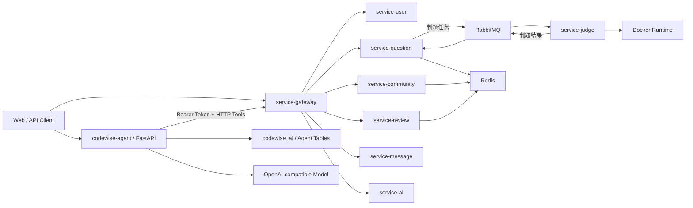

# CodeWise

CodeWise 是面向在线编程、代码判题和错题复习场景的学习平台。主体由 8 个可独立运行的 Spring Boot 服务应用和 2 个公共 Maven 模块组成，旁路运行一个 FastAPI + Node 工具运行时（dsh）的 Agent。平台围绕“做题、判题、复习、交流、AI 辅助”形成完整学习闭环，并使用 Nacos、Gateway、OpenFeign、RabbitMQ、Redis 与 Docker 支撑服务协作和异步业务链路。

## 已实现能力

- 在线判题：代码提交、调试、测试点执行、结果回写与状态查询。
- Java 函数题：LeetCode 题面解析、方法签名解析、批量调试和测试生成。
- 复习系统：根据判题结果维护错题、每日复习、收藏夹、学习计划打卡与错题笔记。
- 学习社区：帖子、题解、评论、点赞、标签和热点排行。
- 消息通知：站内通知、邮件、RabbitMQ 消费和 WebSocket 推送。
- AI 辅助：Java AI 服务提供判题建议和题目追问；Python Agent 支持跨模块工具调用、SSE 过程事件、独立会话和长期摘要。
- 判题运维：按语言维护可复用容器池，支持空闲/占用/等待状态查询及管理员动态扩缩容。

## 系统架构


```mermaid
flowchart LR
    Client["Web / API Client"] --> Gateway["service-gateway"]
    Gateway --> User["service-user"]
    Gateway --> Question["service-question"]
    Gateway --> Review["service-review"]
    Gateway --> Community["service-community"]
    Gateway --> Message["service-message"]
    Gateway --> AI["service-ai"]
    Client --> Agent["codewise-agent / FastAPI"]
    Agent -->|"Bearer Token + HTTP Tools"| Gateway
    Agent --> AgentDB["codewise_ai / Agent Tables"]
    Agent --> LLM["OpenAI-compatible Model"]

    Question -->|"判题任务"| MQ["RabbitMQ"]
    MQ --> Judge["service-judge"]
    Judge -->|"判题结果"| MQ
    MQ --> Question

    Judge --> Docker["Docker Runtime"]
    Question --> Redis["Redis"]
    Community --> Redis
    Review --> Redis
```

- Gateway 校验 JWT，并通过请求头向下游传递用户身份。
- 下游拦截器解析身份并写入 `UserContext`，业务服务继续判断题目作者、记录所有者等资源权限。
- `service-api` 维护 Feign 接口和跨服务 DTO，`service-common` 提供用户上下文、Redis、RabbitMQ 等公共配置。
- 每个业务服务维护自己的数据访问边界，跨服务数据通过 Feign 或消息传递，不使用跨库 SQL 作为常规调用方式。
- Python Agent 由前端携带 CodeWise Bearer Token 直接访问。Agent 使用与 Java 端一致的 JWT 密钥解析用户身份，调用工具时继续携带原 Token，经 Gateway 访问用户、题目、提交和复习接口。
- `service-ai` 与 Python Agent 职责不同：前者处理判题事件驱动建议和题目内追问，后者处理独立 Agent 页面中的跨模块自然语言操作。

## 服务模块

| 模块 | 默认端口 | 职责 |
| --- | ---: | --- |
| `service-gateway` | 8082 | 路由、JWT 校验、身份信息传递 |
| `service-user` | 8081 | 注册登录、用户资料和用户统计 |
| `service-question` | 8084 | 题目、测试点、提交记录和判题入口 |
| `service-judge` | 8086 | Docker 执行、编译运行和结果判定 |
| `service-review` | 8097 | 复习计划、每日复习和收藏夹 |
| `service-community` | 8087 | 帖子、题解、评论、点赞和排行 |
| `service-message` | 8083 | 邮件、站内通知、消息消费和 WebSocket |
| `service-ai` | 8085 | 判题建议、SSE 追问和会话记忆 |
| `service-judge-go` | - | Java 判题的 Go 重构原型（本地调试与提交判题子集） |
| `codewise-agent` | 8000 | dsh 工具运行时推理、网关工具调用、Agent 会话与消息 |
| `service-api` | - | Feign 接口与跨服务 DTO |
| `service-common` | - | 用户上下文及公共 Redis、MQ 配置 |

## 技术栈

| 分类 | 技术 |
| --- | --- |
| 基础框架 | Java 21、Spring Boot 3.2.4、Maven |
| 服务通信 | Spring Cloud Gateway、Nacos、OpenFeign |
| 数据访问 | MySQL、MyBatis-Plus、MyBatis XML |
| 缓存与并发 | Redis、Redisson、定时任务、分布式锁 |
| 异步通信 | RabbitMQ |
| 实时通信 | WebSocket、SSE |
| Python Agent | Python、FastAPI、SQLAlchemy、dsh（Node 工具运行时）、TypeScript（工具插件） |
| 模型接入 | OpenAI-compatible API、用户自定义模型配置、AES-GCM 密钥加密 |
| 判题执行 | Docker Java API、Java 17 用户代码环境 |
| 前端 | Vue 3、TypeScript、Pinia、Element Plus、Monaco Editor |

## 核心实现

### 异步判题

`service-question` 创建提交记录并发送 RabbitMQ 任务，`service-judge` 在 Docker 中编译和运行用户代码，再通过结果消息更新提交记录。WebSocket 用于实时通知，数据库提交记录是最终可查询结果，因此用户离线或推送失败时仍可主动查询。

### Java 函数题

函数模式读取方法名和参数配置，生成 `Main.java` 调用用户的 `Solution`。同一次提交只编译一次，再逐个运行测试输入。函数返回值写入 `result.txt`，用户的 `System.out` 保留为调试日志，避免调试输出污染答案比较。

支持批量补充测试、输入输出哈希去重、标准答案异步生成测试任务。随机测试以通用类型生成器为基础，并为跨参数约束预留题目级 Generator 与 Validator 扩展点。

### AI 辅助与 Python Agent

AI 能力分为两条相互独立的链路：

- `service-ai` 消费判题失败事件，生成并持久化题目建议，再通过消息服务推送；题目内追问使用 POST SSE 返回增量文本。
- `codewise-agent` 提供独立会话页面的通用助手，模型可以根据用户问题选择工具，查询真实的 CodeWise 数据后再组织回答。

Agent 运行时为 dsh（Node 子进程）：Python 门面（FastAPI）按会话驱动 dsh，工具以 cordis 插件（`codewise-agent/agent-runtime/plugins/`）注册进工具管线，由运行时统一提供参数校验、超时与错误归一。

当前工具覆盖（51 个网关工具 + 网页抓取 + 代码执行）：

- 查询当前用户信息、最近提交、单条或批量提交详情。
- 搜索题目、查询题目详情与批量详情（收藏夹列表为瘦身投影，完整题干按需批量获取）。
- 查询复习记录、复习计划和复习配置；在用户明确要求时更新复习配置。
- 收藏夹全量操作：建夹/改名/删除、批量收藏与移除题目、跨夹移动（服务端行锁）、题目定位。
- 社区帖子：信息流/搜索/热榜/详情、发帖/编辑/删除、评论与删评、显式点赞（幂等）、我的内容。
- 学习计划：今日待办、计划列表/详情、日历打卡、周报，以及计划的创建/更新/删除。
- 笔记：文件夹管理、笔记列表/详情、创建/更新/移动/删除。
- 通用能力：当前时间查询、网页抓取（内置 SSRF 守卫）、代码执行沙箱。

工具不接受模型生成的 `userId`。FastAPI 从 Bearer Token 的 `sub` 解析当前用户，工具经 `CodeWiseGateway` 携带原始 Token 调用 Gateway，由 Java 服务执行资源权限校验。

会话元数据与消息持久化在 `agent_conversation` / `agent_message`（codewise_ai 库）；会话上下文与历史压缩由 dsh 运行时的 JSONL 会话日志与 compaction 组件承担，Python 门面每轮刷新会话私有 Token 文件。

流式接口 `/api/agent/stream` 返回以下 SSE 事件：

| 事件 | 用途 |
| --- | --- |
| `session.event` | 透传 dsh 运行时事件：assistant/chunk 增量回答、tool/call、tool/result 等工具过程事件 |
| `done` | 本次会话处理完成（含 finish_reason 与最终内容） |
| `error` | 流开始后的异常信息 |

用户问题和完整助手回答在流正常结束后统一提交事务；生成中途失败时回滚本次消息写入。

Agent HTTP 接口：

| 方法 | 路径 | 说明 |
| --- | --- | --- |
| `GET` | `/api/agent/agent_conversation` | 查询当前用户的会话列表 |
| `POST` | `/api/agent/conversation` | 创建新会话 |
| `PUT` | `/api/agent/conversation/{conversationId}/name` | 修改当前用户会话名称 |
| `DELETE` | `/api/agent/conversation/{conversationId}` | 删除会话及关联消息 |
| `GET` | `/api/agent/messages/{conversationId}` | 查询会话消息 |
| `POST` | `/api/agent/call` | 非流式 Agent 调用 |
| `POST` | `/api/agent/stream` | SSE 流式 Agent 调用及工具过程事件 |

### Docker 判题与容器池

判题服务通过 Docker 隔离用户代码，设置运行超时、内存限制和 `network=none`，并统一识别 AC、WA、CE、RE、TLE。

判题服务为 Java 预创建 2 个容器，为 Python、C 和 C++ 各预创建 1 个容器。请求通过按语言隔离的阻塞队列租借空闲容器，归还前清理 `/workspace`；清理失败时删除并重建容器。管理员可通过 `/api/judge/containers` 查询池状态、扩容或删除空闲容器，忙碌容器和每种语言的最后一个容器不可删除。

### 缓存、排行和分页

- Redis 保存部分高频计数和缓存数据，定时任务批量回写 MySQL。
- Redis ZSet 保存社区热点分数，定时任务负责周期性重算。
- 列表接口使用基于 ID 的游标分页；关联用户、标签和点赞状态使用批量查询减少 N+1。
- 通知和函数测试用例使用业务唯一键处理重复写入。

## 项目结构

```text
CodeWise/
|-- service-gateway/
|-- service-user/
|-- service-question/
|-- service-judge/
|-- service-review/
|-- service-community/
|-- service-message/
|-- service-ai/
|-- service-api/
|-- service-common/
|-- service-judge-go/            # Java 判题的 Go 重构原型
|-- codewise-agent/             # Python Agent（FastAPI 门面 + dsh Node 工具运行时）
|   |-- api/                    # FastAPI 会话、普通调用和 SSE 接口
|   |-- dsh_bridge/             # dsh 桥接：会话进程管理、Token 刷新、事件透传
|   |-- agent-runtime/          # dsh Node 部署闭包（cordis 配置与工具插件）
|   |-- entry/ + mapper/        # SQLAlchemy 模型和数据访问
|   |-- sql/agent_tables.sql
|   `-- main.py
|-- deploy/                     # Docker 全栈部署（compose、服务镜像模板、初始化脚本）
|-- docs/
|-- pom.xml
`-- mvnw / mvnw.cmd
```

## Docker 部署

除本地开发外，项目提供一键 Docker 全栈部署：一台 Linux 主机 + Docker 即可在十分钟左右跑起 16 个容器（前端、网关、7 个业务服务、Python Agent、MySQL/Redis/RabbitMQ/Nacos、判题沙箱、Mailpit 邮件捕获），并已在实机完成端到端验证。

三步启动：

```bash
cd CodeWise/deploy
cp .env.example .env
vi .env          # 必改：所有 change-me 项（内部 Token/JWT/数据库/root 密码）

cd ..
docker compose -f deploy/docker-compose.yml up -d --build
docker compose -f deploy/docker-compose.yml ps   # 等待全部 healthy（首次含镜像构建，约 10-20 分钟）
```

打开 `http://localhost/`，用 `admin` 登录（密码取 `.env` 的 `ROOT_PASSWORD`，首次启动自动创建）。

首次启动自动完成：MySQL 建库建表与迁移 SQL、OutboxPro 事件表、root 管理员创建（`sys_init` 表幂等）、RabbitMQ 拓扑与判题容器池预热。

镜像构成：

- 8 个服务镜像共用模板 `deploy/Dockerfile.service`（容器内 Maven 多阶段构建，`--build-arg MODULE=...` 区分）；
- 判题基础镜像 `deploy/judge-base/`（JDK 17 + 非 root judge 用户 + Jackson 函数题依赖）；
- Python Agent 镜像 `codewise-agent/Dockerfile`（Node 22 + Python 3.11 双运行时，nginx 以 `/agentapi/` 反代）；
- 前端镜像由 compose 内联构建兄弟仓库 CodeWise-frontend，并挂载 `deploy/nginx.conf`。

部分功能缺配置时静默降级（服务仍可启动）：验证码邮件默认进 Mailpit（Web 界面 `127.0.0.1:8025`）；平台内置 AI 模型需在 Nacos 配置 Provider 列表；用户自定义模型需 `.env` 配置 `API_KEY_MASTER_KEY`。快速开始与常见问题见 [deploy/README.md](deploy/README.md)，HTTPS、运维与镜像发布见 [deploy/OPERATIONS.md](deploy/OPERATIONS.md)。

## 本地运行

环境依赖：JDK 21、Python 3.11+、MySQL 8、Redis、RabbitMQ、Nacos 和 Docker。

### 首次运行或 IDE 加载失败

如果 IDE（如 IntelliJ IDEA）在加载项目时提示依赖解析失败，或 Maven 每次启动都重新加载且出错，这是因为共享模块（`service-api`、`service-common`）还未安装到本地 Maven 仓库。

使用提供的一键安装脚本：

```powershell
.\mvnw.cmd -f service-common\pom.xml -DskipTests install
.\mvnw.cmd -f service-api\pom.xml -DskipTests install
```

然后分别编译或启动所需服务：

```powershell
.\mvnw.cmd -f service-question\pom.xml test
.\mvnw.cmd -f service-judge\pom.xml test
```

判题服务所在 Docker 主机需要提前构建 `codewise-java-judge:17` 镜像，并提供 Jackson JAR。

函数测试生成链路还要求 `service-ai` 与 `service-question` 配置相同的 `CODEWISE_INTERNAL_TOKEN`。用户自定义模型密钥由 `API_KEY_MASTER_KEY` 加密，仓库中不得保存真实密钥。运行时生成的函数产物写入 `data/function-artifacts`，不纳入版本控制。

Python Agent 位于仓库内 `codewise-agent/`，使用 `codewise-agent/sql/agent_tables.sql` 初始化会话表，并在 `codewise-agent/.env` 中配置：

```text
DATABASE_URL=mysql+pymysql://<user>:<password>@127.0.0.1:3306/codewise_ai?charset=utf8mb4
API_KEY_MASTER_KEY=<与 Java AI 配置加密一致的 32 字节 Base64 密钥>
CODEWISE_GATEWAY_URL=http://127.0.0.1:8082
JWT_SECRET=<与 Java jwt.secret 一致>
```

启动 Agent：

```powershell
cd codewise-agent
.\.venv\Scripts\python.exe main.py
```

FastAPI 默认监听 `127.0.0.1:8000`。前端调用 `/api/agent/**` 时必须携带 CodeWise 登录 Token；`JWT_SECRET` 不一致会导致 Agent 返回 `401 Token 签名无效`。

## 文档

完整文档索引见 [文档导航](docs/README.md)。

- [技术设计与核心链路](docs/technical-design.md)
- [项目目录说明](docs/project-structure.md)
- [工程体量快照](docs/project-metrics.md)
- [Controller 接口总览](docs/backend-controller-api.md)
- [维护手册](docs/maintenance-guide.md)
- [Docker 快速开始](deploy/README.md)
- [部署运维手册](deploy/OPERATIONS.md)
- [复习与收藏接口](docs/service-review/api.md)
- [社区接口](docs/service-community/api.md)
- [通知中心与消息服务](docs/service-message/README.md)
- [社区审核与申诉 API](docs/service-community/api.md#内容审核与申诉-api)
- [社区审核与申诉实现总结](docs/service-community/api.md#内容审核与申诉实现摘要)
- [函数测试生成接口](docs/service-ai/README.md#函数模式随机测试生成接口)
- [自定义 AI 配置接口](docs/service-ai/README.md#用户自定义-ai-服务配置接口)
- [Java AI 模块与会话记忆](docs/service-ai/README.md)
- [V1 发布基线](docs/v1-release-notes.md)
## 项目定位

本项目用于个人学习与工程实践，重点展示异步判题、函数题适配、容器池调度、学习数据闭环和 AI 辅助等核心实现及其设计过程。
