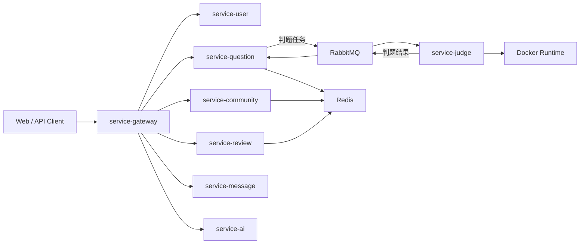

# CodeWise

CodeWise 是面向在线编程、代码判题和错题复习场景的个人学习实践项目。项目由 8 个可独立运行的 Spring Boot 服务应用和 2 个公共 Maven 模块组成，使用 Nacos、Gateway、OpenFeign、RabbitMQ、Redis 与 Docker 实践服务拆分和异步业务链路。

当前版本具备微服务的基本运行形态，但不以生产级治理为目标，尚未完整实现熔断降级、分布式链路追踪、分布式事务、多机容灾和完整沙箱安全策略。

## 已实现能力

- 在线判题：代码提交、调试、测试点执行、结果回写与状态查询。
- Java 函数题：LeetCode 题面解析、方法签名解析、批量调试和测试生成。
- 复习系统：根据判题结果维护错题、每日复习和收藏夹。
- 学习社区：帖子、题解、评论、点赞、标签和热点排行。
- 消息通知：站内通知、邮件、RabbitMQ 消费和 WebSocket 推送。
- AI 辅助：判题建议、题目追问、SSE 流式响应和会话记忆。
- 判题运维：按语言维护可复用容器池，支持空闲/占用/等待状态查询及管理员动态扩缩容。

## 架构边界


```mermaid
flowchart LR
    Client["Web / API Client"] --> Gateway["service-gateway"]
    Gateway --> User["service-user"]
    Gateway --> Question["service-question"]
    Gateway --> Review["service-review"]
    Gateway --> Community["service-community"]
    Gateway --> Message["service-message"]
    Gateway --> AI["service-ai"]

    Question -->|"判题任务"| MQ["RabbitMQ"]
    MQ --> Judge["service-judge"]
    Judge -->|"判题结果"| MQ
    MQ --> Question

    Judge --> Docker["Docker Runtime"]
    Question --> Redis["Redis"]
    Community --> Redis
    Review --> Redis
```

- Gateway 校验 JWT，并通过请求头向下游传递用户身份。
- 下游拦截器解析身份并写入 `UserContext`，业务服务继续判断题目作者、记录所有者等资源权限。
- `service-api` 维护 Feign 接口和跨服务 DTO，`service-common` 提供用户上下文、Redis、RabbitMQ 等公共配置。
- 每个业务服务维护自己的数据访问边界，跨服务数据通过 Feign 或消息传递，不使用跨库 SQL 作为常规调用方式。

## 服务模块

| 模块 | 默认端口 | 职责 |
| --- | ---: | --- |
| `service-gateway` | 8082 | 路由、JWT 校验、身份信息传递 |
| `service-user` | 8081 | 注册登录、用户资料和用户统计 |
| `service-question` | 8084 | 题目、测试点、提交记录和判题入口 |
| `service-judge` | 8086 | Docker 执行、编译运行和结果判定 |
| `service-review` | 8097 | 复习计划、每日复习和收藏夹 |
| `service-community` | 8087 | 帖子、题解、评论、点赞和排行 |
| `service-message` | 8083 | 邮件、站内通知、消息消费和 WebSocket |
| `service-ai` | 8085 | 判题建议、SSE 追问和会话记忆 |
| `service-api` | - | Feign 接口与跨服务 DTO |
| `service-common` | - | 用户上下文及公共 Redis、MQ 配置 |

## 技术栈

| 分类 | 技术 |
| --- | --- |
| 基础框架 | Java 21、Spring Boot 3.2.4、Maven |
| 服务通信 | Spring Cloud Gateway、Nacos、OpenFeign |
| 数据访问 | MySQL、MyBatis-Plus、MyBatis XML |
| 缓存与并发 | Redis、Redisson、定时任务、分布式锁 |
| 异步通信 | RabbitMQ |
| 实时通信 | WebSocket、SSE |
| 判题执行 | Docker Java API、Java 17 用户代码环境 |
| 前端 | Vue 3、TypeScript、Pinia、Element Plus、Monaco Editor |

## 核心实现

### 异步判题

`service-question` 创建提交记录并发送 RabbitMQ 任务，`service-judge` 在 Docker 中编译和运行用户代码，再通过结果消息更新提交记录。WebSocket 用于实时通知，数据库提交记录是最终可查询结果，因此用户离线或推送失败时仍可主动查询。

### Java 函数题

函数模式读取方法名和参数配置，生成 `Main.java` 调用用户的 `Solution`。同一次提交只编译一次，再逐个运行测试输入。函数返回值写入 `result.txt`，用户的 `System.out` 保留为调试日志，避免调试输出污染答案比较。

支持批量补充测试、输入输出哈希去重、标准答案异步生成测试任务。当前随机生成器只保证参数类型合法；涉及 Two Sum 等跨参数约束时，需要题目级 Generator 和 Validator，不能仅依赖类型随机。

### Docker 判题边界

当前已设置运行超时、内存限制和 `network=none`，并识别 AC、WA、CE、RE、TLE。现阶段仍需补充 PID 限制、CPU 配额、非 root 用户、只读文件系统、编译超时和输出大小限制，因此 README 不将其描述为生产级安全沙箱。

判题服务为 Java 预创建 2 个容器，为 Python、C 和 C++ 各预创建 1 个容器。请求通过按语言隔离的阻塞队列租借空闲容器，归还前清理 `/workspace`；清理失败时删除并重建容器。管理员可通过 `/api/judge/containers` 查询池状态、扩容或删除空闲容器，忙碌容器和每种语言的最后一个容器不可删除。

### 缓存、排行和分页

- Redis 保存部分高频计数和缓存数据，定时任务批量回写 MySQL。
- Redis ZSet 保存社区热点分数，定时任务负责周期性重算。
- 列表接口使用基于 ID 的游标分页；关联用户、标签和点赞状态使用批量查询减少 N+1。
- 通知和函数测试用例使用业务唯一键处理重复写入。

## 已知限制

- Gateway 负责身份认证，下游仍有部分重复查询用户角色的代码，后续将改为签名身份信息加业务资源鉴权。
- Feign 超时、重试和降级策略尚未统一。
- RabbitMQ 消息发布确认、失败补偿和任务可观测性仍在完善。
- WebSocket 当前主要承担实时提醒，高可用连接管理和多实例会话路由尚未实现。
- Nacos 当前用于注册发现和配置加载，未实现完整的动态配置刷新治理。
- 自动化测试已覆盖部分函数解析、权限、随机输入和调试流程，但整体覆盖率仍需提高。

## 项目结构

```text
CodeWise/
|-- service-gateway/
|-- service-user/
|-- service-question/
|-- service-judge/
|-- service-review/
|-- service-community/
|-- service-message/
|-- service-ai/
|-- service-api/
|-- service-common/
|-- docs/
|-- pom.xml
`-- mvnw / mvnw.cmd
```

## 本地运行

环境依赖：JDK 21、MySQL 8、Redis、RabbitMQ、Nacos 和 Docker。

根 POM 当前未配置聚合模块，公共模块发生变更时需要先安装：

```powershell
.\mvnw.cmd -f service-common\pom.xml -DskipTests install
.\mvnw.cmd -f service-api\pom.xml -DskipTests install
```

然后分别编译或启动所需服务：

```powershell
.\mvnw.cmd -f service-question\pom.xml test
.\mvnw.cmd -f service-judge\pom.xml test
```

判题服务所在 Docker 主机需要提前构建 `codewise-java-judge:17` 镜像，并提供 Jackson JAR。

函数测试生成链路还要求 `service-ai` 与 `service-question` 配置相同的 `CODEWISE_INTERNAL_TOKEN`。用户自定义模型密钥由 `API_KEY_MASTER_KEY` 加密，仓库中不得保存真实密钥。运行时生成的函数产物写入 `data/function-artifacts`，不纳入版本控制。

## 文档

- [技术设计与核心链路](docs/technical-design.md)
- [项目目录说明](docs/project-structure.md)
- [Controller 接口总览](docs/backend-controller-api.md)
- [维护手册](docs/maintenance-guide.md)
- [函数测试生成接口](docs/function-testcase-generator-api.md)
- [自定义 AI 配置接口](docs/custom-ai-config-api.md)
- [V1 发布基线](docs/v1-release-notes.md)

## 项目定位

本项目用于个人学习与工程实践。面试或交流时应重点说明当前实现、设计原因、已知缺陷和改进方向，不将尚未实现的生产级能力写成既有成果。
