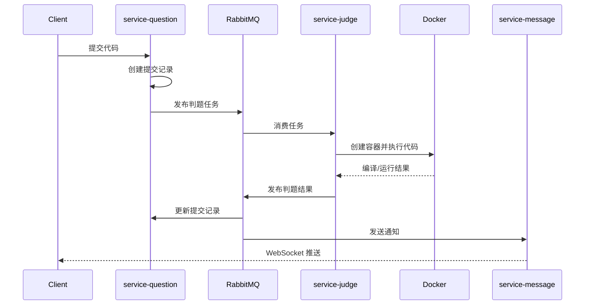

# CodeWise 技术设计

## 1. 设计目标

CodeWise 面向在线刷题场景，核心目标是把高延迟、高风险的代码执行过程与普通业务请求隔离，同时保证题目、提交、复习、社区和通知能力能够独立演进。

当前架构采用 Spring Cloud 微服务体系。Nacos 负责服务发现和外部配置，Gateway 提供统一入口，Feign 承担同步服务调用，RabbitMQ 承担判题和通知等异步链路，Redis 用于缓存、状态、计数和分布式协调。

## 2. 服务边界

| 服务 | 核心数据所有权 | 对外能力 |
| --- | --- | --- |
| 用户服务 | 用户、登录凭证、资料、统计 | 鉴权、用户信息、头像与统计 |
| 题目服务 | 题目、测试点、提交记录 | 题库查询、提交、调试、结果查询 |
| 判题服务 | 判题执行上下文 | 编译、运行、测试点比对 |
| 复习服务 | 复习记录、计划、收藏夹 | 每日复习与学习进度 |
| 社区服务 | 帖子、题解、评论、标签、点赞 | 社区互动、搜索和热点排行 |
| 消息服务 | 通知通道与在线会话 | 邮件和 WebSocket 推送 |
| AI 服务 | AI 请求编排 | 解析和测试用例生成 |

服务间不直接读写对方数据库。用户昵称、头像、题目信息等通过 Feign 批量获取；判题结果和通知通过 RabbitMQ 传递。

## 3. 认证与上下文透传

1. 客户端携带 JWT 请求网关。
2. `service-gateway` 的全局过滤器校验令牌。
3. 网关将用户 ID、用户名等可信上下文写入请求头。
4. 下游服务拦截器读取请求头并写入线程级 `UserContext`。
5. Feign 拦截器继续向下游服务透传用户上下文。

业务服务不应依赖客户端请求体中的 `userId` 判断权限。修改帖子、题解和评论等操作都应使用服务端解析出的登录用户 ID。

## 4. 异步判题设计

### 4.1 处理流程



### 4.2 为什么使用消息队列

- 判题耗时明显高于普通接口，不占用 HTTP 请求线程等待。
- 题目服务与判题服务解耦，判题实例可以独立扩容。
- 消息天然形成缓冲，避免短时间大量提交直接压垮 Docker 主机。
- 判题结果可由多个消费者分别完成记录回写、通知和复习触发。

### 4.3 判题安全边界

- 用户代码在 Docker 容器中执行，不直接运行在业务 JVM。
- 对编译、运行、超时和结果比对分别建模。
- 判题机应进一步限制 CPU、内存、进程数、网络和文件系统权限。
- 生产环境应使用独立判题节点，并禁止容器访问宿主敏感资源。

## 5. Redis 计数双桶

帖子点赞、评论点赞和题解浏览量属于高频增量操作。每次操作直接更新 MySQL 会形成热点行，因此先写入 Redis Hash，再定时批量回写。

```text
请求写入 bucket-0
        |
        | Lua 原子切换 0 -> 1，并返回旧桶 0
        v
定时任务消费 bucket-0        新请求写入 bucket-1
        |
        v
批量更新 MySQL，成功后删除 bucket-0
```

Lua 脚本把“读取当前桶”和“切换新桶”合并为一个 Redis 原子操作。Redisson 任务锁防止同一定时任务重叠执行，避免桶被快速切回后误删新增量。数据库更新抛出异常时不会执行 Redis 删除，旧桶数据可在后续周期再次消费。

## 6. 社区热点排行

社区服务使用 Redis ZSet 保存帖子 ID 与热度分数。当前热度由点赞、评论和发布时间衰减共同决定：

```text
score = (likeCount * 0.5 + commentCount * 2.0) / sqrt(hoursSinceCreated + 2)
```

- 点赞和评论发生时实时调整 ZSet 分数。
- 定时任务周期性读取数据库并完整重建排行榜，校正增量误差。
- 查询使用 `reverseRange` 获取最高分记录。
- 帖子详情使用独立 Hash 缓存，ZSet 只承担排序职责。

## 7. 帖子与题解的数据复用

社区帖子和题解共享评论、标签基础设施。`comment.post_id` 和 `tags.post_id` 表示目标 ID，`type` 字段使用 `POST` 或 `SOLUTION` 标识目标来源。

相关查询必须同时携带目标 ID 和类型：

```sql
where post_id = ? and type = 'SOLUTION'
```

标签唯一索引为 `(post_id, tag_name, type)`，避免帖子 ID 和题解 ID 相同时互相冲突。

## 8. 分页与批量查询

列表接口优先使用基于主键的游标分页：

```sql
where id > :lastId
order by id asc
limit :pageSize + 1
```

多查询一条用于判断 `hasNext`。与深分页相比，游标分页能够稳定使用主键索引，但不适合直接跳转到任意页。

列表中的用户、标签和点赞状态使用 ID 集合批量查询并在内存中组装，避免循环调用数据库或 Feign 形成 N+1 请求。

## 9. 数据一致性策略

| 场景 | 当前策略 |
| --- | --- |
| 发帖、评论防重复 | 请求 ID 写入 Redis，限制重复提交 |
| 点赞与浏览计数 | Redis 增量桶 + 定时批量回写 |
| 热点排行 | 实时增量 + 周期全量重建 |
| 帖子/题解删除 | 主体权限校验，关联数据级联清理 |
| 跨服务用户信息 | Feign 批量查询 |
| 判题结果 | RabbitMQ 异步回写 |

后续可继续完善消息幂等表、失败重试、死信队列、Outbox 事件以及统一 Feign 降级策略。

## 10. 数据库与索引

- 业务表主键使用 `BIGINT`。
- 高频过滤字段建立组合索引，例如用户、状态、创建时间和业务来源。
- 计数字段使用增量更新，并通过 `greatest(..., 0)` 防止出现负数。
- 数据库按服务拆分，命名采用 `codewise_<module>`。
- 结构演进同时维护完整建表脚本和增量迁移脚本。

## 11. 可观测性与异常处理

当前服务已包含业务日志和部分统一异常处理，但完整生产化仍建议补充：

- 全链路 traceId 和统一结构化日志。
- Feign 调用的超时、重试、熔断和降级。
- RabbitMQ 消费失败次数、死信数量和积压监控。
- Docker 判题耗时、超时率和资源使用监控。
- Redis 回写任务的桶编号、增量数量和失败告警。

## 12. 后续演进

1. 增加单元测试、Mapper 集成测试和核心链路端到端测试。
2. 引入数据库迁移工具统一执行版本化 SQL。
3. 完善判题容器资源限制和镜像生命周期管理。
4. 为 RabbitMQ 消费增加业务幂等与死信补偿。
5. 统一错误码、中文异常响应和 Feign ErrorDecoder。
6. 增加 OpenAPI 文档和可观测性基础设施。
